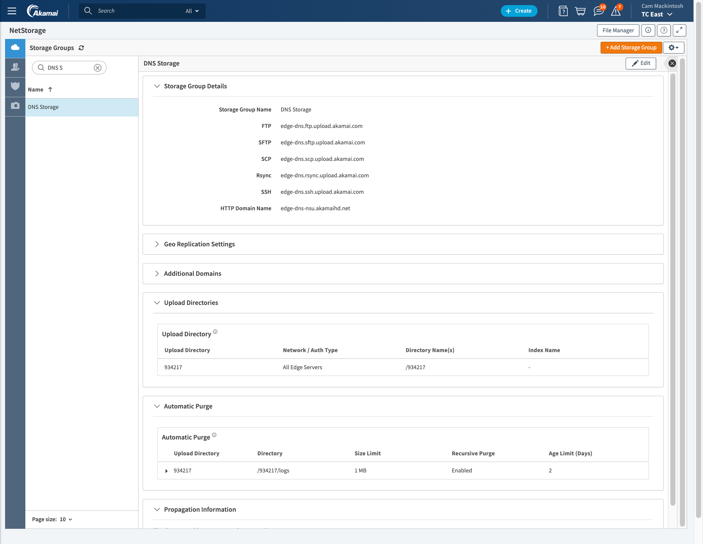
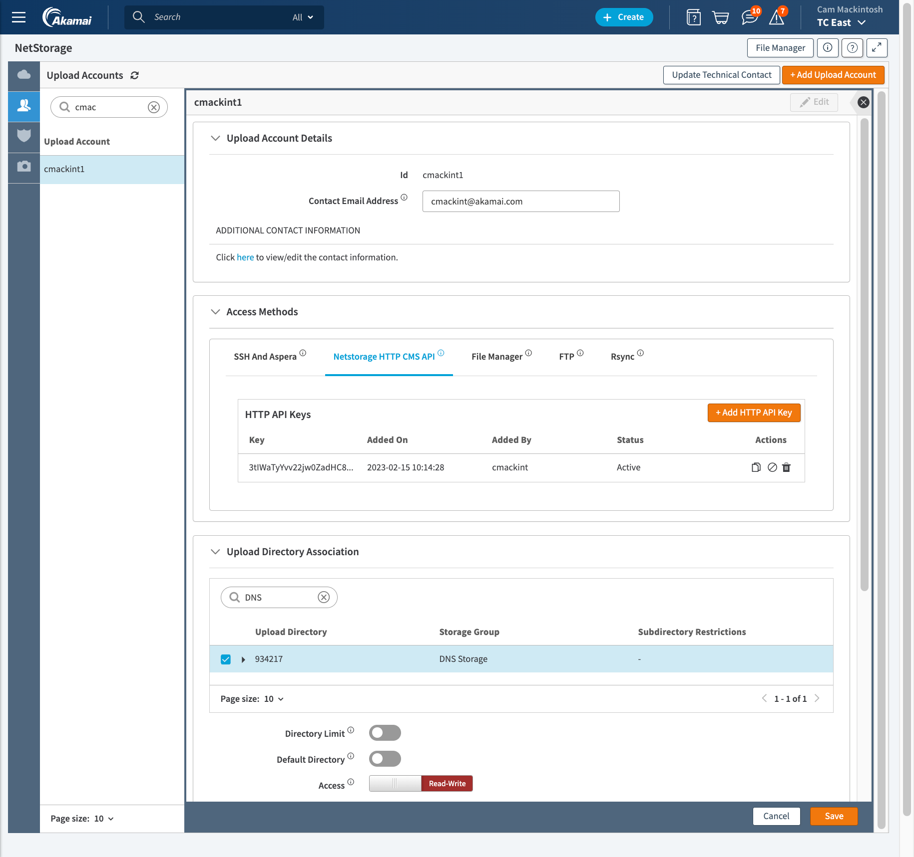
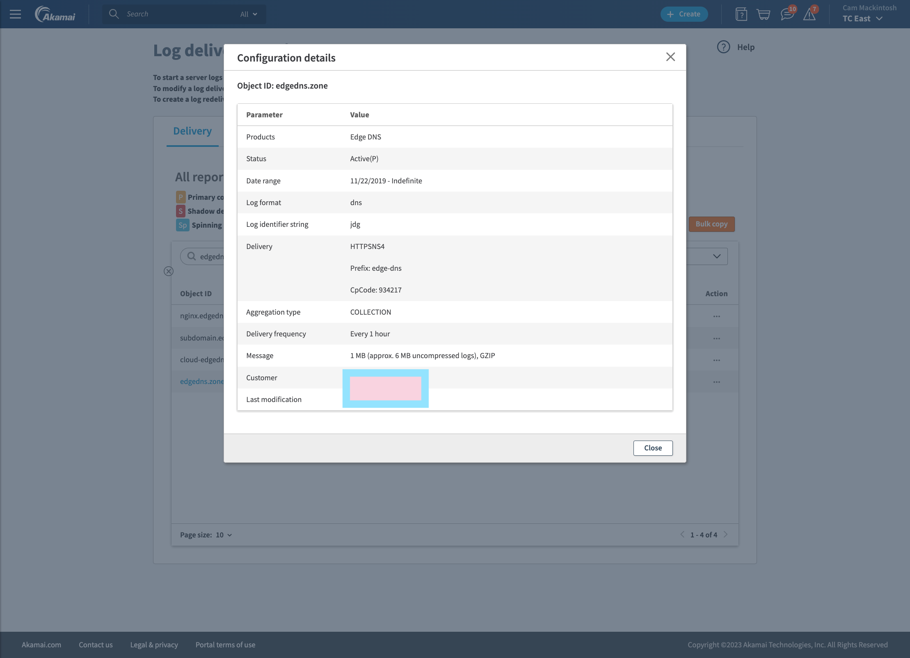
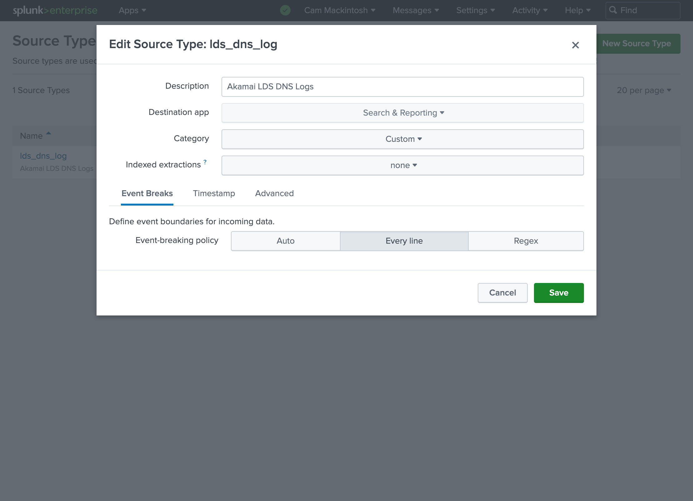
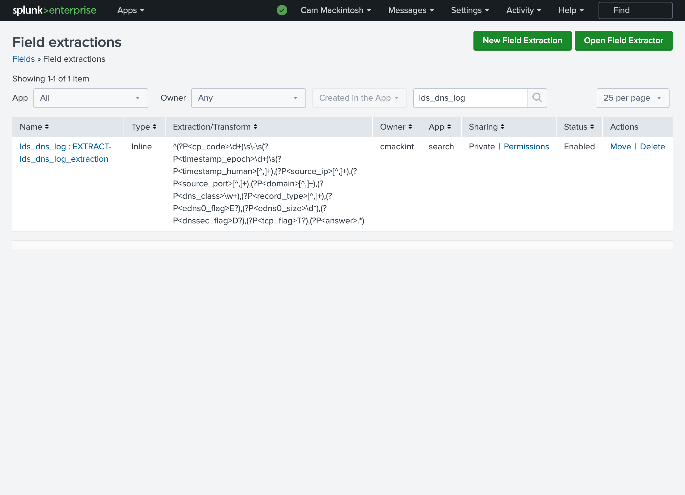
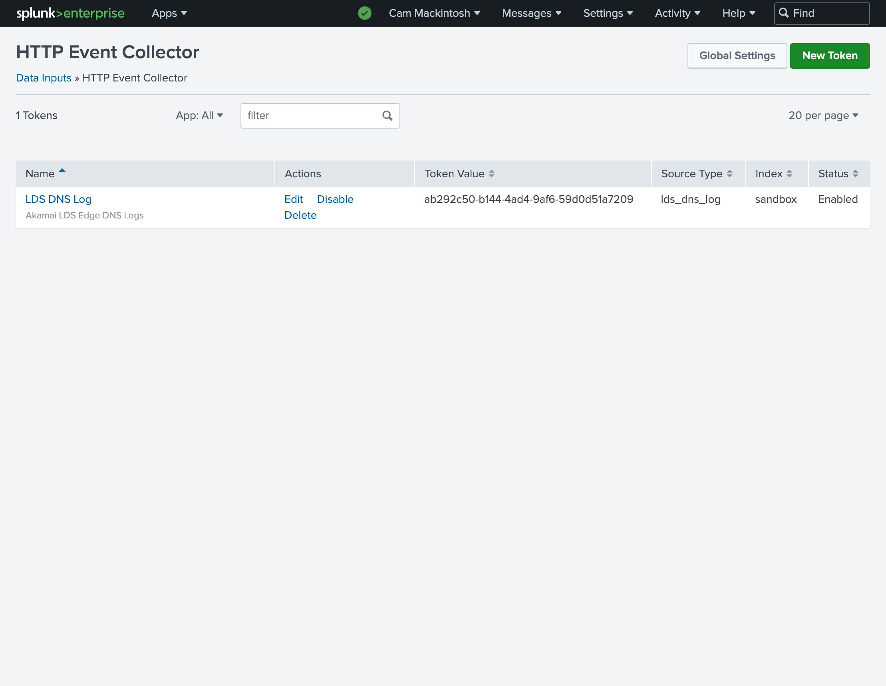
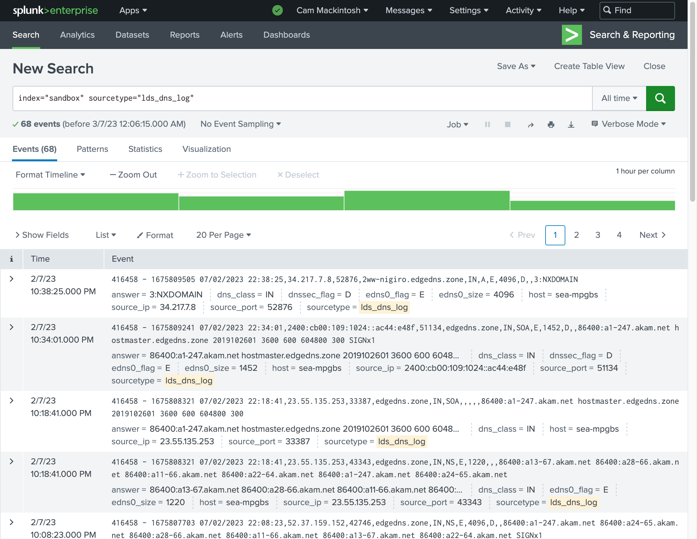
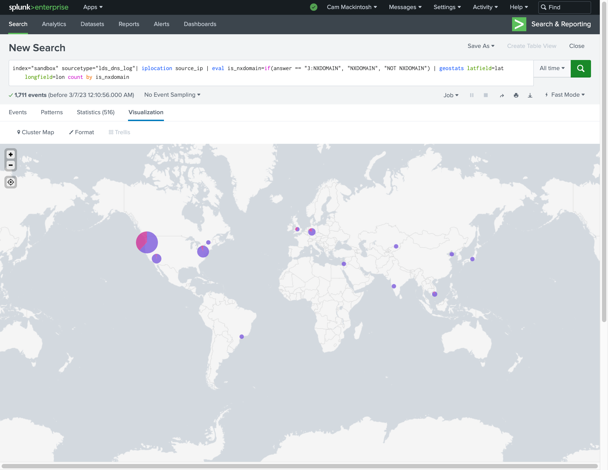
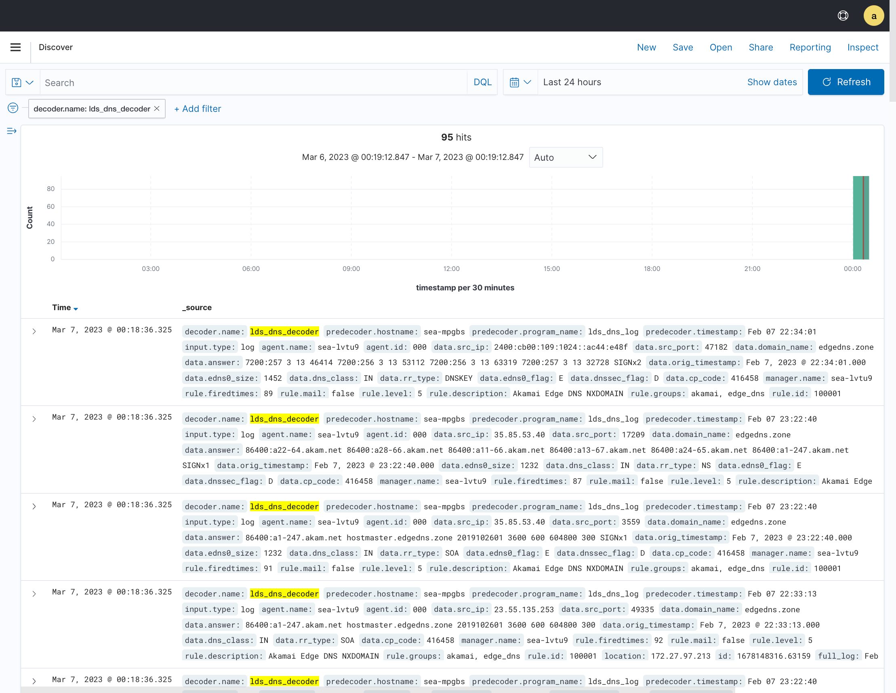
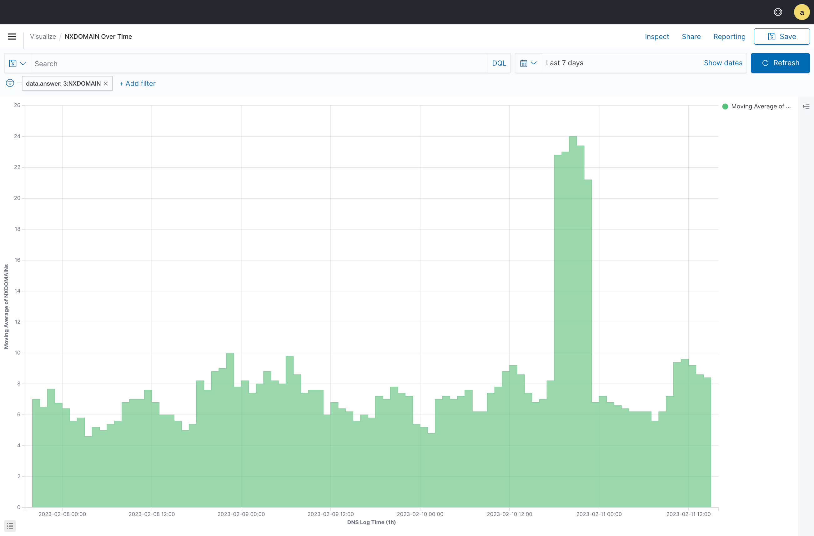

Overview
=========

This example shows how to configure the script to deliver Edge DNS logs for the zone 'edgedns.zone' into 
both Splunk and Wazuh.


Akamai Setup
============

The "DNS Storage" NetStorage storage group is created. It has a single upload directory with CP code 934217.

Automatic purge is enabled for the log directory `/934217/logs`




The "cmackint1" upload account is created. It has access to the 934217 upload account. It has an HTTP API access
key.



The log delivery is enabled for "edgedns.zone" into NetStorage `/934217/logs`. The compressed log files are delivered 
every hour in 1MB chunks.




Delivery to Splunk
==================

Splunk Configuration
--------------------

The "lds_dns_log" source type is created.



The field extraction is created for the "lds_dns_log" source type. It's defined by a regular expression.



The HTTP Event Collector token is created. It has a default source type  of "lds_dns_log". It has a default index of 
sandbox.




Script Configuration
--------------------

The [splunk_config.yaml](./splunk_config.yaml) file contains the configuration. 

The "edgedns" and "open" sections are missing, since we aren't delivering Edge DNS records.

The "splunk.lds_hec.index" and "splunk.lds_hec.source_type" are missing since we're using the HEC token's
default values.

Results
-------

We run the script using the Splunk configuration YAML file. 

We can see the log events in Splunk search. Splunk uses the field extraction to extract fields from our log messages.



We can create visualizations and dashboards based on this data.



Delivery to Wazuh
=================

Wazuh Configuration
-------------------

The SysLog remote receiving is enabled by adding the following remote to the config file `/var/ossec/etc/ossec.conf`
on the Wazuh Server. The Wazuh Server will accept TCP connections on port 514. The LDS connector script will run from 
a machine with IP address 172.27.97.213.

```
<ossec_config>
  <remote>
    <connection>syslog</connection>
    <port>514</port>
    <protocol>tcp</protocol>
    <allowed-ips>127.0.0.1</allowed-ips>
    <allowed-ips>172.27.97.213</allowed-ips>
  </remote>
</ossec_config>
```

The [lds_dns_log_decoder.xml](../../docs/wazuh/lds_dns_log_decoder.xml) file is added to the custom decoder directory
`/var/ossec/etc/decoders/` on the Wazuh Server.

The [lds_dns_log_rule.xml](../../docs/wazuh/lds_dns_log_rule.xml) file is added to the custom decoder directory
`/var/ossec/etc/rules/` on the Wazuh Server.

Script Configuration
--------------------

The [wazuh_config.yaml](./splunk_config.yaml) file contains the configuration. 

The "edgedns" and "open" sections are missing, since we aren't delivering Edge DNS records.

The "syslog.lds_app_name" is set to "lds_dns_log". The decoder added above will only match logs with a program
name "lds_dns_log"

Results
-------

We run the script using the Wazuh configuration YAML file. 

We can see the log alerts in Wazuh's OpenSearch Discover. Wazuh uses the custom decoder to extract fields from our log messages.



We can create visualizations and dashboards based on this data.

