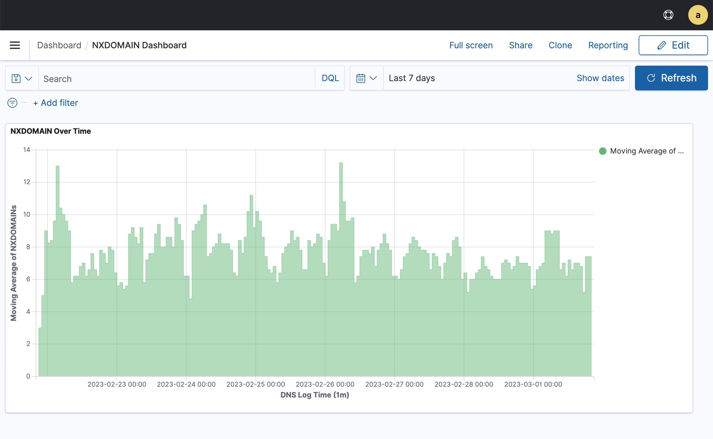

Akamai Log Delivery Service Connector 
=====================================

This script moves log data from Akamai's Log Delivery Service (LDS) into a destination service. We currently 
support Splunk and Wazuh/SysLog

This project is in early development. 


Architecture
------------

This solution continuosuly delivers Akamai log data into a destination service. So how does this work?

1. The Log Delivery Service periodically delivers compressed log files to NetStorage.
2. NetStorage stores and automatically purges the log files. It provides an API for downloading log files
3. The LDS Connector script monitors for new log files NetStorage. It downloads them, parses out events, 
   and sends them to a destination service


Getting Started
===============

Prerequisites
-------------

See the [Akamai documentation](docs/akamai/README.md) to configure NetStorage and the Log Delivery Service.

See the [Splunk documentation](docs/splunk/README.md) to configure delivery to Splunk.

See the [Wazuh documentation](docs/wazuh/README.md) to configure delivery to Wazuh. This should also work with other
services accepting SysLog messages.


Configuration
-------------

The script is configured using a YAML file passed as a command line argument. 

Use `config_template.yaml` as a template. It includes a comment describing each field.

The README files in the docs/ directory contain more information.
See the [LDS Connector documentation](docs/lds_connector/README.md).


Installation
------------

This package will eventually be ported to PyPI and installable via pip. I've tested this script on macOS and 
Ubuntu.

You'll need to have Python >= 3.9, PIP, and virtualenv installed. On Ubuntu, install the packages `python3.9` 
and `python3.9-venv`. 

First, create a virtual environment and activate it. 
```sh
lds-connector % python3.9 -m venv env
lds-connector % source env/bin/activate
```

Next, ensure PIP is up-to-date and install the required packages. 
```sh
lds-connecotr % python3.9 -m pip install --upgrade pip
lds-connector % python3.9 -m pip install -r requirements.txt
```

Great job! The script is ready.


Running
-------

Run the script with the following command. Use the `-h` flag for the help message. 

``` sh
$ python3.9 lds_connector.py --config config.yaml
```


Monitoring
----------

The LDS connector script emits logs. We're working on improving this and are considering integration with monitoring 
services like Grafana


Script Features
===============

At the highest-level, the script moves log data from NetStorage into destination services.

Let's dig into how it works a bit.
- The script is configured using a YAML file. This is passed as a command line argument. The script must be restarted
  to process any changes to the YAML file.
- The script processes the log files chronologically. The log files are named using 
  [a standard format](https://techdocs.akamai.com/log-delivery/docs/file-names) that contains the time range and a part
  number. The script fetches the listing of available log files and sorts them by the start time. 
- The script is able to resume processing where it left off. The script saves the current/last log file's metadata to 
  disk. When the script is first run, it checks the saved metadata and resumes where it left off.
- The script can deliver logs to either Splunk or Wazuh. 

This script can optionally deliver Edge DNS records for a given zone.
- The user enables Edge DNS record sending for a given zone in the YAML config
- The script periodically fetches the record set for the zone from an Akamai API, reformats them, and sends them to
  Splunk


Example Use Case
=================

An example use case of this script is to improve visibility into NXDOMAIN spikes. 

The script periodically delivers Edge DNS log events into Splunk or Wazuh

The following Splunk dashboard shows some simple DNS traffic visualizations
- A chart of NXDOMAIN count over time
- A geo map showing where DNS queries originated from and what proportion were NXDOMAINs. Splunk converts the source IP 
  in the Edge DNS log lines into geographic data.


Notice the NXDOMAIN spike. We use Splunk Search to narrow in on the spike and investigate. The traffic mostly came from 
Portland and Yekaterinburg. Most from Portland were not NXDOMAINs. Most from Yekaterinburg were NXDOMAINs.


We can produce similar visualizations in Wazuh as well.




Developer Notes
===============

You can run the unit tests using the following command
```sh
lds-connector % python3.9 -m unittest discover -vb
... Test output
----------------------------------------------------------------------
Ran 21 tests in 0.018s

OK
```


You can run the coverage analysis using the following commands
```sh
lds-connector % coverage run -m unittest discover
```

Authors
=======

This project is maintained by Akamai's Security Technology Group.

The original author is Cam Mackintosh. Her email is `cmackint@akamai.com`


License
=======

Copyright 2023 Akamai Technologies, Inc. All rights reserved.

Licensed under the Apache License, Version 2.0 (the "License"); you may not use this file except in compliance with the
License. You may obtain a copy of the License at

http://www.apache.org/licenses/LICENSE-2.0

Unless required by applicable law or agreed to in writing, software distributed under the License is distributed on an 
"AS IS" BASIS, WITHOUT WARRANTIES OR CONDITIONS OF ANY KIND, either express or implied. See the License for the 
specific language governing permissions and limitations under the License.

