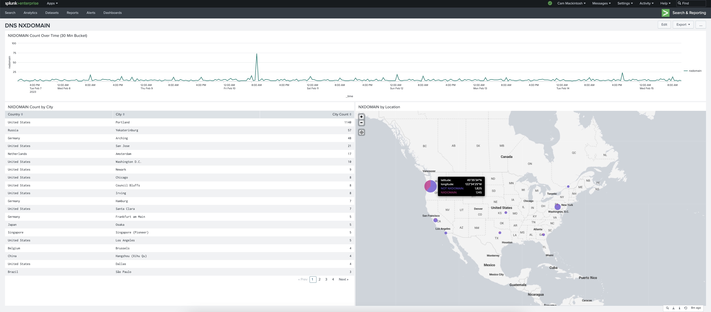
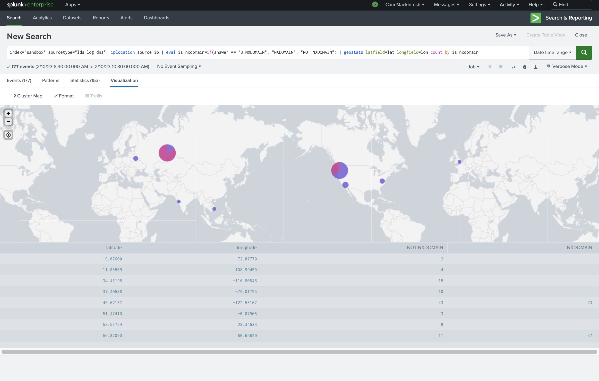
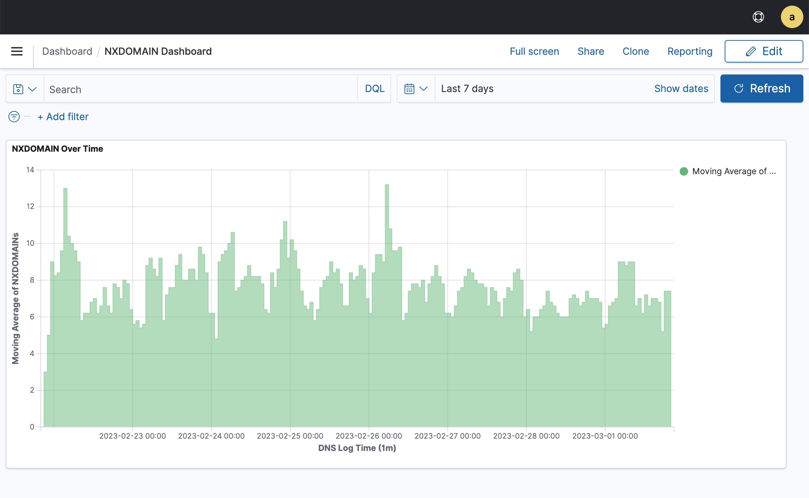

Akamai Log Delivery Service Connector 
=====================================

Version 2.1 - June 14, 2023

Introduction
------------

The LDS Connector is a solution to periodically deliver Akamai log events into third-party data platforms. 
We currently support delivering logs to Splunk, Wazuh, and anything other platform accepting SysLog messages.

The Log Delivery Service (LDS) is an Akamai service that periodically delivers Akamai log files via email, FTP storage, 
or Akamai NetStorage. 

The LDS Connector is a script that monitors a NetStorage location for LDS logs, parses them into log events, and sends
them to your data platform.

The LDS Connector's **Log Delivery** feature monitors NetStorage for LDS logs, parses them into log events, and delivers
them to your data platform.

The LDS Connector's **Record Set Delivery** feature periodically fetches an Edge DNS record set using the Akamai APIs,
parses them into log events, and delivers them to your data platform. This currently only suports a single zone.

This document will show you
1. How to configure Log Delivery Service to send your Akamai logs to NetStorage
2. How to configure your third-party data platform to receive Akamai logs
  - For Splunk users: How to enable event receiving, add a source type, and add field extraction
  - For Wazuh users: How to enable SysLog receiving, add a custom decoder, add a custom rule
3. How to install, configure, and run the LDS Connector script

The LDS Connector works with any Log Delivery Service log format. However, we'll provide specific examples for DNS 
logs.


Getting Started
===============

Prerequisites
-------------

See the [Akamai documentation](docs/akamai/README.md) to configure NetStorage and the Log Delivery Service. 

If you want to deliver logs to Splunk, then see the [Splunk documentation](docs/splunk/README.md).

If you want to deliver logs to Wazuh, then see the [Wazuh documentation](docs/wazuh/README.md).

If you want to deliver logs via SysLog, then see the [SysLog documentation](docs/syslog/README.md).


Configuration
-------------

The script is configured using a YAML file passed as a command line argument. 

Use `config_template.yaml` as a template. It includes a comment describing each field. Optional fields can be 
deleted if they're not needed. 

The documents linked in the above Prerequisites section detail how to set each of these fields. They include 
annotated screenshots. Please consult this documentation.

See [here](docs/lds_connector/README.md) for further details on the `lds` fields.

Installation
------------

This package will eventually be ported to PyPI and installable via pip. I've tested this script on macOS and 
Ubuntu.

You'll need to have Python >= 3.9, PIP, and virtualenv installed. On Ubuntu, install the packages `python3.9` 
and `python3.9-venv`. 

First, create a virtual environment and activate it. 
```sh
lds-connector % python3.9 -m venv env
lds-connector % source env/bin/activate
```

Next, ensure PIP is up-to-date and install the required packages. 
```sh
lds-connector % python3.9 -m pip install --upgrade pip
lds-connector % python3.9 -m pip install -r requirements.txt
```

Great job! The script is ready.


Running
-------

Run the script with the following command. Use the `-h` flag for the help message. 

``` sh
$ python3.9 lds_connector.py --config config.yaml
```


Monitoring
----------

The LDS connector script emits logs. We're working on improving this and are considering integration with monitoring 
services like Grafana


Script Features
===============

At the highest-level, the script moves log data from NetStorage into destination services.

Let's dig into how it works a bit.
- The script is configured using a YAML file. This is passed as a command line argument. The script must be restarted
  to process any changes to the YAML file.
- The script processes the log files chronologically. The log files are named using 
  [a standard format](https://techdocs.akamai.com/log-delivery/docs/file-names) that contains the time range and a part
  number. The script fetches the listing of available log files and sorts them by the start time. 
- The script is able to resume processing where it left off. The script saves the current/last log file's metadata to 
  disk. When the script is first run, it checks the saved metadata and resumes where it left off.
- The script can deliver logs to either Splunk or Wazuh. 

This script can optionally deliver Edge DNS records for a given zone.
- The user enables Edge DNS record sending for a given zone in the YAML config
- The script periodically fetches the record set for the zone from an Akamai API, reformats them, and sends them to
  Splunk


Example Use Case
=================

An example use case of this script is to improve visibility into NXDOMAIN spikes. 

The script periodically delivers Edge DNS log events into Splunk or Wazuh

The following Splunk dashboard shows some simple DNS traffic visualizations
- A chart of NXDOMAIN count over time
- A geo map showing where DNS queries originated from and what proportion were NXDOMAINs. Splunk converts the source IP 
  in the Edge DNS log lines into geographic data.



Notice the NXDOMAIN spike. We use Splunk Search to narrow in on the spike and investigate. The traffic mostly came from 
Portland and Yekaterinburg. Most from Portland were not NXDOMAINs. Most from Yekaterinburg were NXDOMAINs.



We can produce similar visualizations in Wazuh as well.



A more detailed example is included at [EXAMPLES/](./EXAMPLES/dns_logs/README.md)


Developer Notes
===============

You can run the unit tests using the following command
```sh
lds-connector % python3.9 -m unittest discover -vb
... Test output
----------------------------------------------------------------------
Ran 21 tests in 0.018s

OK
```


You can run the coverage analysis using the following commands
```sh
lds-connector % coverage run -m unittest discover
lds-connector % coverage report
lds-connector % coverage html
```

Authors
=======

This project is maintained by Akamai's Security Technology Group.

The original author is Cam Mackintosh. Her email is `cmackint@akamai.com`


License
=======

Copyright 2023 Akamai Technologies, Inc. All rights reserved.

Licensed under the Apache License, Version 2.0 (the "License"); you may not use this file except in compliance with the
License. You may obtain a copy of the License at

http://www.apache.org/licenses/LICENSE-2.0

Unless required by applicable law or agreed to in writing, software distributed under the License is distributed on an 
"AS IS" BASIS, WITHOUT WARRANTIES OR CONDITIONS OF ANY KIND, either express or implied. See the License for the 
specific language governing permissions and limitations under the License.

