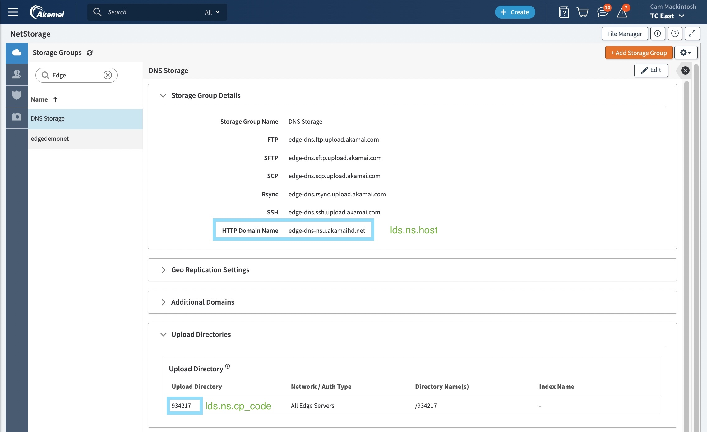
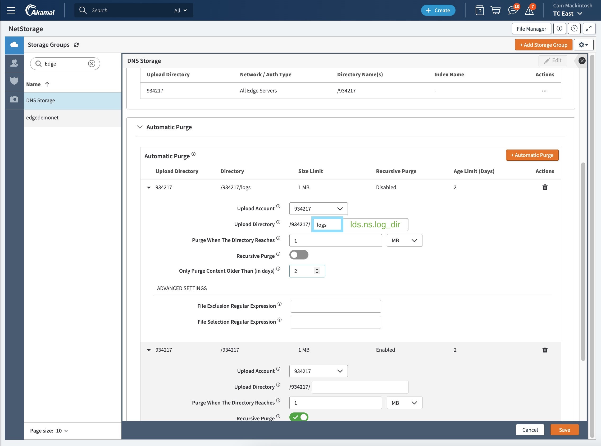
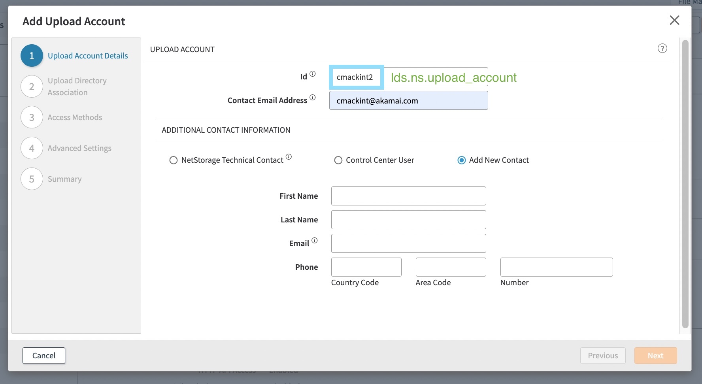
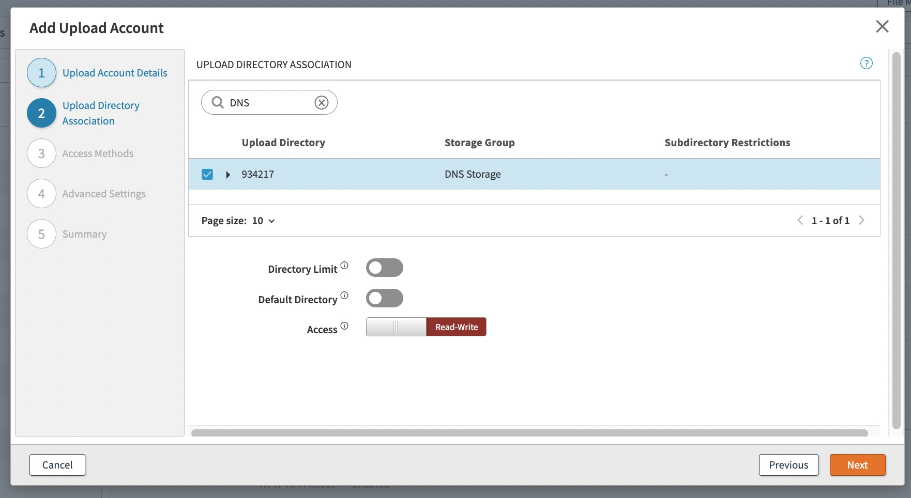
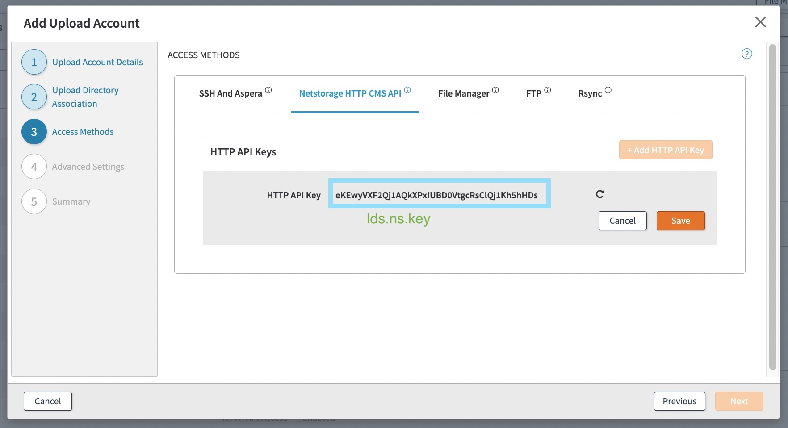
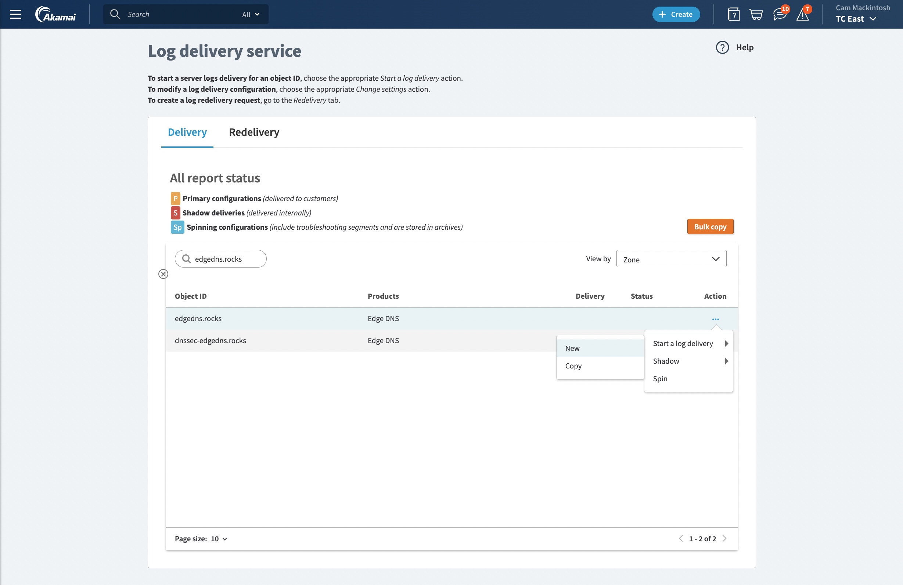
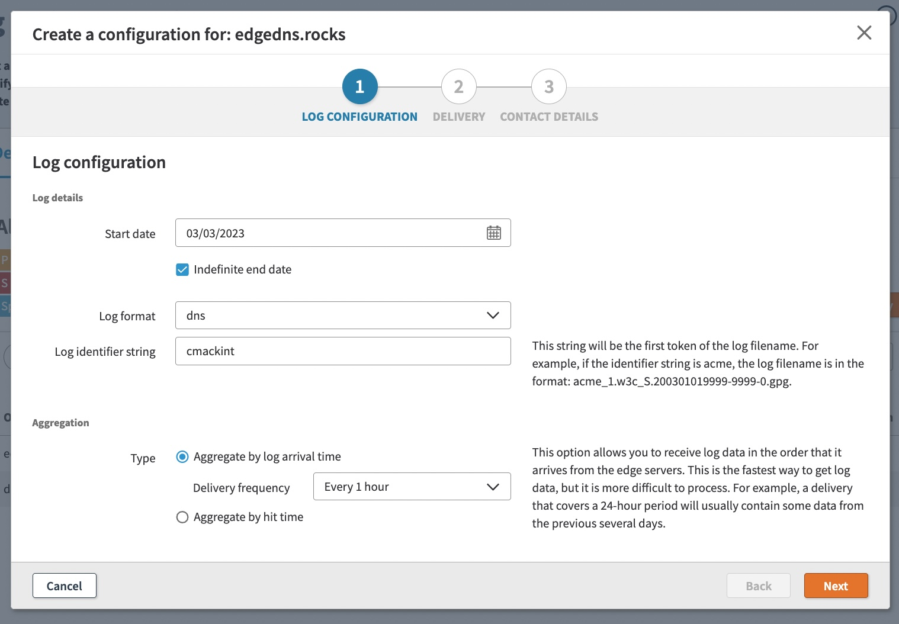
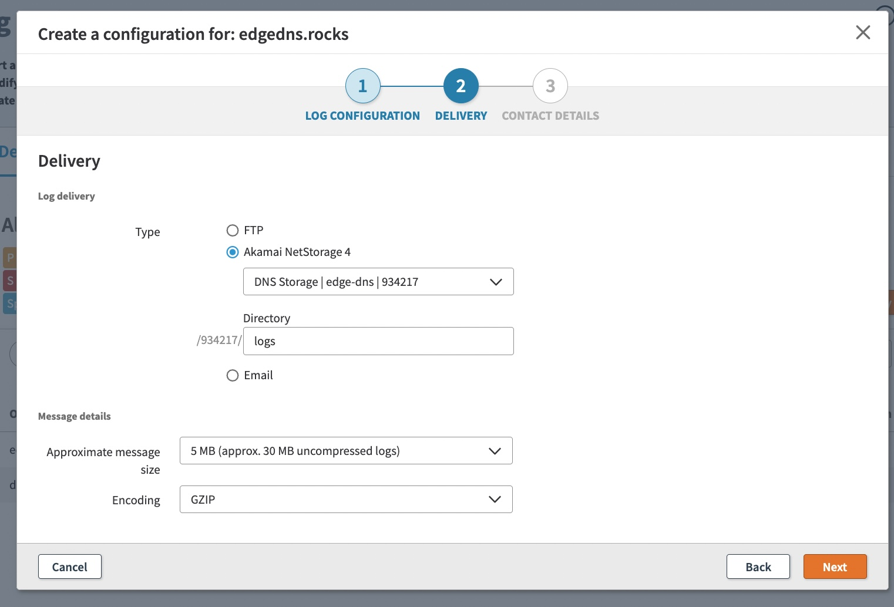
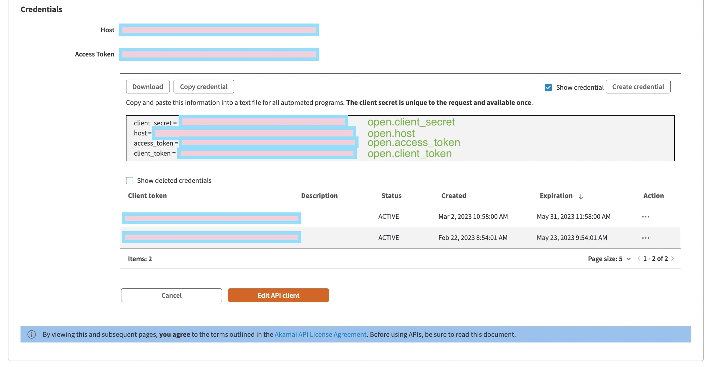

# Introduction

This document details how to configure Akamai services to make logs available to the LDS Connector.

This document covers the following
- LDS basics / key terminology
- NetStorage basics / key terminology
- How to configure NetStorage to store logs
- How to configure NetStorage API access so the LDS Connector can download logs
- How to configure Log Delivery Service to deliver logs into NetStorage
- How to configure Akamai API access so the LDS Connector can fetch Edge DNS records (optional)


# Background

Akamai's infrastructure continuously collects logs from thousands of edge servers around the globe. Akamai's 
Log Delivery Service (LDS) delivers these logs to customers.

LDS supports log delivery by email, FTP server, or NetStorage. It supports several log formats, compression, and 
encryption. The delivery period is configurable, with a minimum period of 1 day. 

NetStorage is Akamai's distributed cloud storage solution. It supports API access, automatic purge policies, 
and permissions.

A **storage group** is the basic unit in a NetStorage instance where content is stored. It contains one/more root
**upload directories**. Each upload directory has a **content provider (CP) code** used for billing/reporting. The
upload directory name is the CP code.

An **upload account** is an account used to access a specific upload directory in a storage group. It can be configured
with different **access methods**, such as HTTP API or FTP. An upload directory can be accessed by multiple upload 
accounts.


# NetStorage Configuration

We need to configure NetStorage to store the log files, implement an automatic purge policy, and provide API access
to the log files (for the script). 

First, we'll create a storage group. You can use an existing storage group. Otherwise, create a new storage group 
by following [these instructions](https://techdocs.akamai.com/netstorage/docs/create-a-storage-group).

Take note of the following...



Next, we'll add an automatic purge policy for the log directory. Go to NetStorage > Storage Groups. Edit the storage 
group and add an automatic purge configuration
- `Upload Account`: The CP code noted above.
- `Upload Directory`: The directory where the logs will be stored.
- `Purge When The Directory Reaches`: The log directory's maximum size. 
- `Only Purge Content Older Than (in days)`: The minimum number of days to keep files for. Files newer than this 
    time will not be purged, even if the directory file size exceeds the maximum.



NetStorage only needs to store the log files long enough for the script to move them into Splunk. If there's an issue 
ingesting log data into Splunk, the unprocessed log files in NetStorage may be automatically purged before the issue is 
resolved. This means that log data is lost. 

You'll want to choose automatic purge settings to balance storage cost and your need for log retention. Some things to 
consider
- LDS delivers logs to NetStorage every X hours. How much log data is generated every X hours on average? Will my
  automatic purge settings accomodate this much data?
- Is it possible for log data generation rate to dramatically increase? For example during a DDoS attack?
- If Splunk goes down, do I need the log data delivered during this time? 

Next, we'll configure an upload account to access the upload directory. Go to NetStorage > Upload Accounts. Add an
upload account. 

Choose an upload account ID and enter your contact details.


Add the upload directory to the upload account.


Add a NetStorage HTTP CMS API key.


Click create!

Great job! NetStorage is configured. It can take a few hours for the upload account permissions to propagate.
You will see 403 errors when running the LDS Connector until these changes are propagated.

# Log Delivery Service Configuration

We need to configure LDS to deliver logs into our NetStorage log directory. Go to 
Common Services -> Log Delivery.

Start a log delivery on the object you're interested in


Set the format, aggregation type to by log arrival time, and delivery frequency to 1 hour.


Set the delivery to the NetStorage directory configured above. Set the message size to 5MB and the encoding to GZIP.


Enter your contact details and hit create!

You'll do this for each object (like Edge DNS zone) you want to enable log delivery for. Choose a different identifier
for each object. The identifier appears in the log filename and is used to differentiate logs for different objects.

Great job! LDS is configured. It can take a few hours for log delivery to start.

# LDS Connector Configuration

We need to configure the LDS connector script to access NetStorage.

Use the [config_template.yaml](../../config_template.yaml) file for reference.

- `lds.ns.host`:
  - Required: Yes
  - The NetStorage Storage Group's HTTP domain name. See above screenshots.
- `lds.ns.upload_account`:
  - Required: Yes
  - The NetStorage upload account ID. See above screenshots.
- `lds.ns.cp_code`:
  - Required: Yes
  - The NetStorage upload directory CP code. See above screenshots.
- `lds.ns.key`: 
  - Required: Yes
  - The NetStorage HTTP API key. See above screenshots.
- `lds.ns.use_ssl`:
  - Required: Yes
  - Whether or not to use SSL to fetch data from NetStorage. You should always use this.
- `lds.ns.log_dir`:
  - Required: Yes
  - The subdirectory inside the upload directory where LDS will deliver the logs.
- `lds.log_download_dir`:
  - Required: Yes
  - Where to download the logs from NetStorage to on the local machine. Each log file is deleted after being processed
- `lds.timestamp_parse`:
  - Required: Yes
  - How to parse the timestamp from the log lines. This is a [parse](https://pypi.org/project/parse/) format string.
- `lds.timestamp_strptime`:
  - Required: Yes
  - How to interpret the parsed timestamp. This is a [datetime strptime()](https://docs.python.org/3/library/datetime.html) format string.
- `lds.log_poll_period_sec`:
  - Required: No, default 60
  - How often to check NetStorage for new log files

Below is an example. You can ommit fields to use the default.
```yaml
lds : 
  ns : 
    host : 'edge-dns-nsu.akamaihd.net'
    upload_account : 'cmackint'
    cp_code : '934217'
    key : 'gj6oN18BhHO1md259j8l3DFTjl0yhwbVrK7jgDLIE'
    use_ssl : true 
    log_dir : 'ednslogs'
  log_download_dir : 'tmp/'
  timestamp_parse: '{} - {} {timestamp},{}'
  timestamp_strptime: '%d/%m/%Y %H:%M:%S'
```

The timestamp fields are used to extract a timestamp from each log line. This extracted timestamp is used as the Splunk
event timestamp. This ensures each log event is index by when it was emitted, rather than when it was sent to Splunk.


# Edge DNS Record Configuration (Optional)

The LDS Connector's Record Set Delivery feature allows delivering the Edge DNS records for a give Edge DNS zone to
your destination

This requires configuring Akamai OPEN API credentials, such that the script is able to fetch these records. 
These are different than the NetStorage API credentials, and easier to configure. See the following instructions

https://techdocs.akamai.com/developer/docs/set-up-authentication-credentials



You'll need to configure the `open` and `edgedns` sections of the YAML config.
You'll also need to configure `splunk` or `syslog` accordingly as well.
Use the [config_template.yaml](../../config_template.yaml) file for reference.
