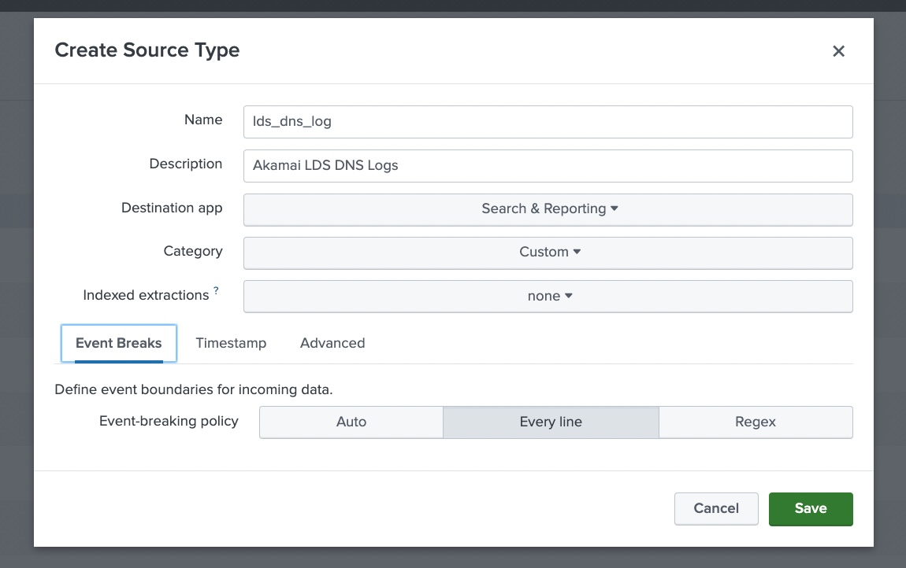
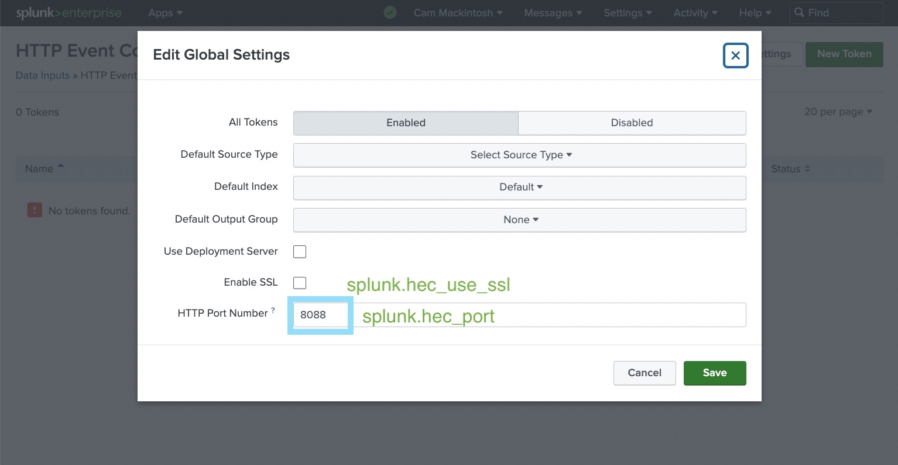
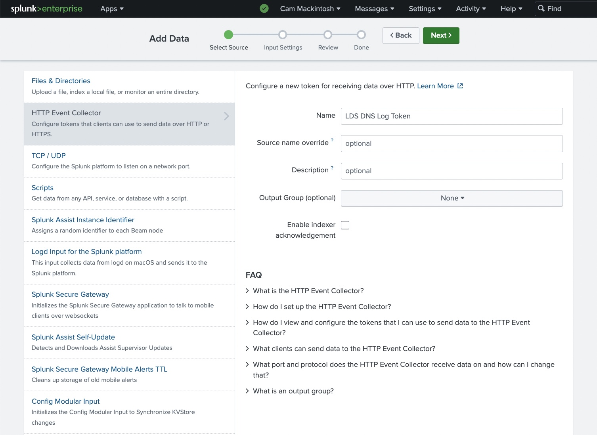
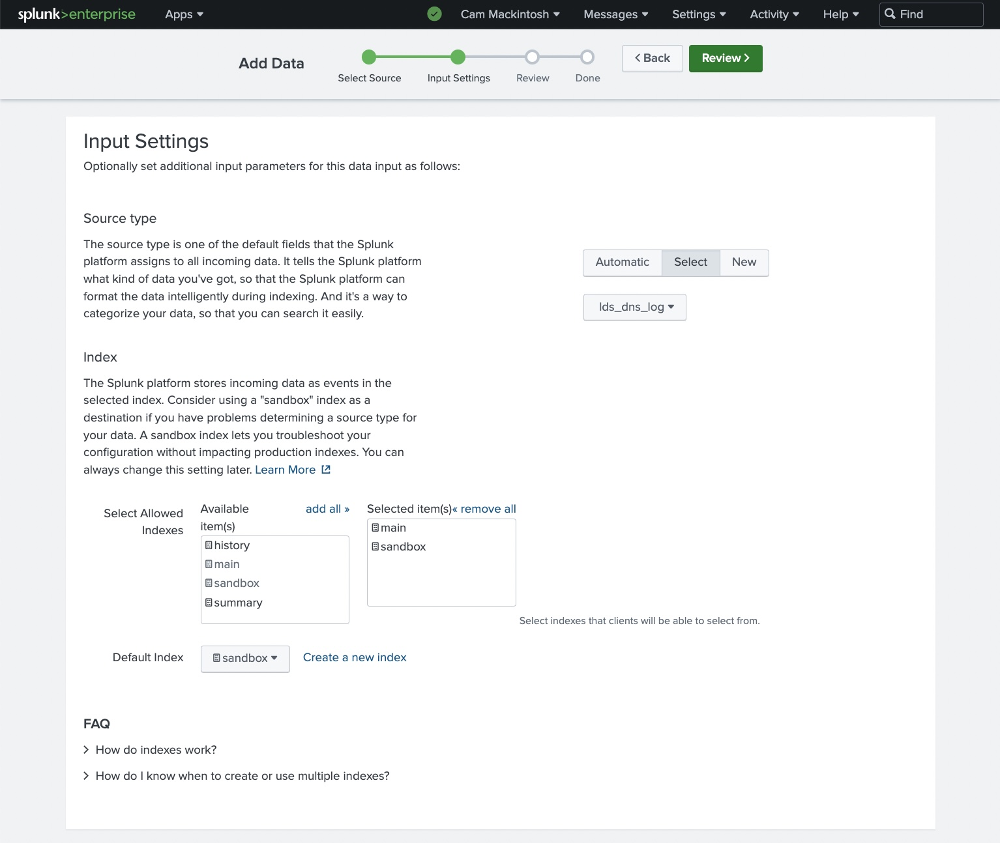
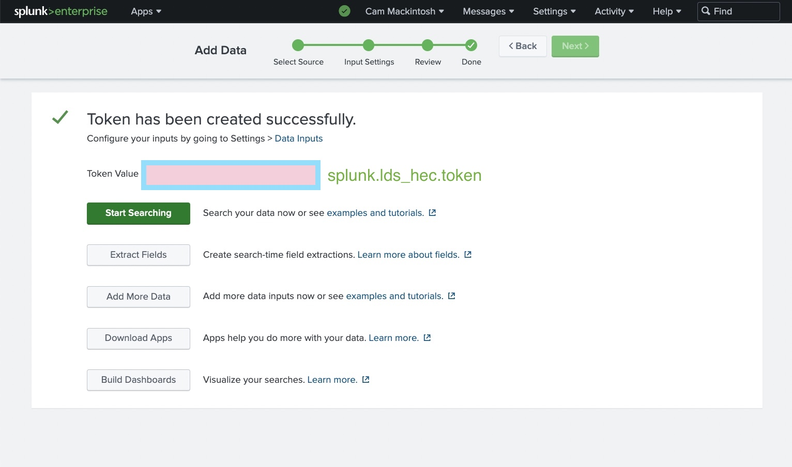
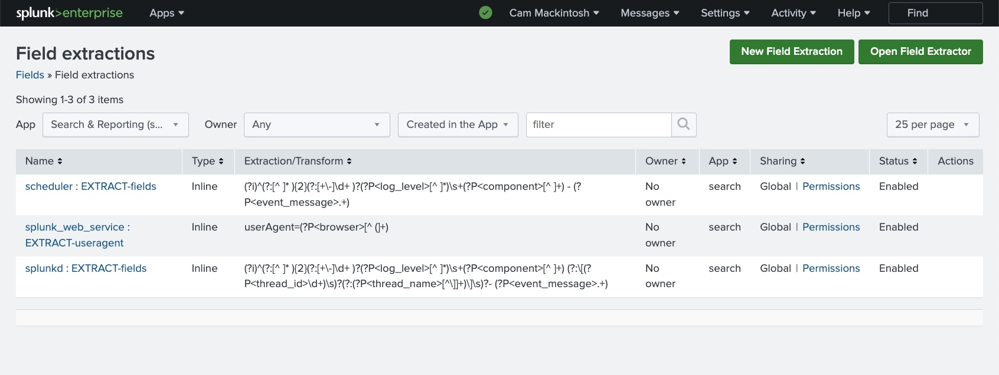
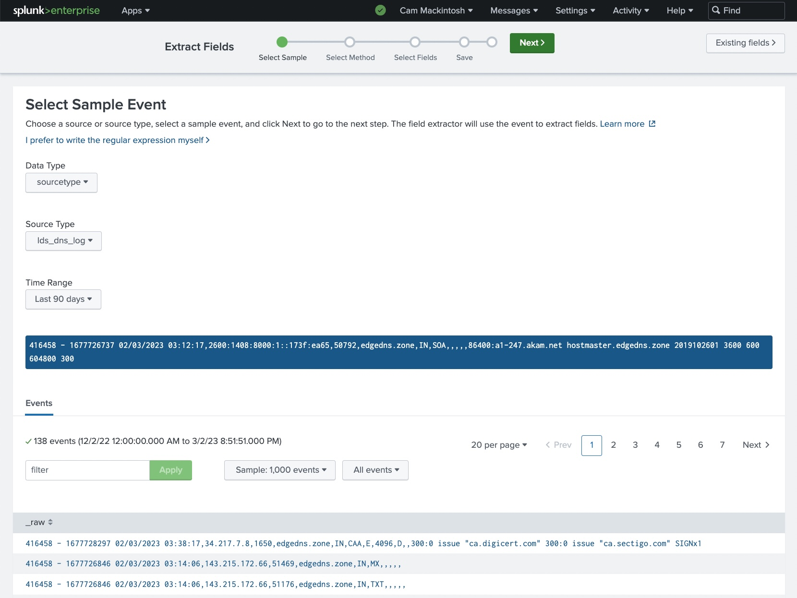
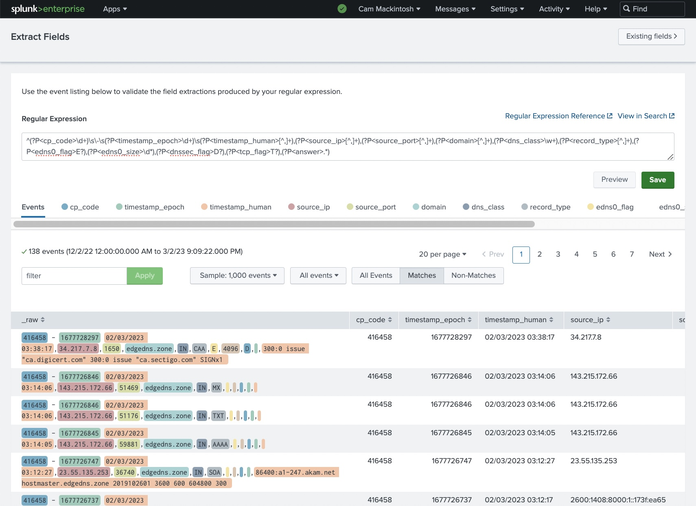
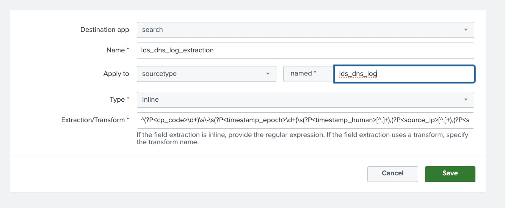

Introduction
============

This document details how to configure log delivery into Splunk

This document covers the following
- Splunk basics / key terminology
- How to configure Splunk to receive log events
- How to add a Splunk source type and field extraction for our log events
- How to configure the LDS Connector to deliver to Splunk


Background
==========

Splunk is a data platform that allows you to search, analyze, and visualize data gathered from a variety of sources.

Splunk receives **raw data** from a variety of sources. It indexes this raw data, converting it to events and storing 
them under an index.

An **event** is a single unit of data in Splunk. Each event consists of a timestamp, the data, metadata (host, 
source type, source), and any fields extracted from the data.

A **source type** defines how raw data is converted into events. A **field extraction** can be defined for a source 
type, defining how fields are extracted from the data. The source type also contains configuration on how to parse the timestamp from the raw data.

Splunk Web is a web interface used for interacting with Splunk data. Users can submit 
**SPL (Search Processing Language)** commands to find, analyze, and visualize data. Users can create dashboards backed 
by these commands.

The **Splunk HTTP Event Collector (HEC)** is an HTTP endpoint hosted by the Splunk instance. Applications can send data
into Splunk by POST-ing it to this endpoint. It uses token-based authentication. A default source-type is associated 
with each token.


Splunk Configuration
====================

We need to configure Splunk create a source type for our log, create an HEC token, and define field extractions

First, we'll create a source type for our LDS log format. Go to Settings -> Data -> Source Types. 
Click "New Source Type" button 
- `Name`: Choose the source type name
- `Event Breaks`: Every line
- `Timestamp`: Auto




Next, we'll enable the HTTP Event Collector. Got to Go to Settings -> Data -> Data Inputs -> HTTP Event Collector.

Enable all tokens. Enable SSL if you'd like. Choose the port number.


Next, we'll create an HTTP Event Collector token. Go to Settings -> Data -> Data Inputs -> HTTP Event Collector. 
Click the "New Token" button

Enter a name


Select the default source type to that created above. Set the default index. 


Create the token!



We're all done. Splunk can receive events!


Field Extraction
================

We need to create a field extraction for our source type. 

There are two approaches. 
1. Using the Field Extractor GUI tool. It requires that Splunk already has ingested some events for the source type 
   we're defining an extraction for. It lets you test the field extraction against all existing events
2. Add a field extraction rule directly. This is useful if you already know the regex for your field extraction.

Using Field Extractor GUI
-------------------------

Go to Settings -> Knowledge -> Fields -> Field Extractions. click the "Open Field Extractor" button.



Set the source type. Select an example event



Choose to use either delimiters or regular expressions. I'll use regular expressions.



Save your field extraction. You're all done!

Add Field Extraction Directly
-----------------------------

Go to Settings -> Knowledge -> Fields -> Field Extractions. click the "New Field Extraction" button.

Set a name. Enter the source type name. Enter the regex.



LDS Connector Configuration
============================

We need to configure the LDS connector script to deliver logs to Splunk.

Use the [config_template.yaml](../../config_template.yaml) file for reference

You'll need the following information
- The hostname or IP address of the Splunk Server
- The HEC port configured above
- Whether HEC uses SSL or not
- The LDS token generated above.

Below are the Splunk YAML configuration options.

- `splunk.host`: 
   - Required: Yes
   - The Splunk hostname or IP address
- `splunk.hec_port`:
   - Required: Yes
   - The HTTP Event Collector port
- `splunk.hec_use_ssl`:
   - Required: Yes
   - Whether to use SSL when sending events to the HTTP Event Collector
- `splunk.lds_hec.token`: 
   - Required: Yes
   - The HTTP Event Collector's token
- `splunk.lds_hec.source_type`:
   - Required: No, default can be set for HTTP Event Collector token in Splunk
   - The Splunk source type to use
- `splunk.lds_hec.index`:
   - Required: No, default can be set for HTTP Event Collector token in Splunk
   - The Splunk index to store events under
- `splunk.lds_hec.batch_size`:
   - Required: No, default is 10
   - The number of log messages to publish at once to Splunk
- `splunk.edgedns_hec.*`:
   - Required: No
   - Only configure this if you're using the Record Set Delivery feature

Below is an example.
```yaml
splunk : 
  host : '127.0.0.1'
  hec_port : 8088
  hec_use_ssl : true 
  lds_hec :
    token : '8e1ea35b-9904-47df-94af-442b415b90b6'
    source_type: 'lds_log_dns'
    index: 'sandbox'
```


References
==========

https://docs.splunk.com/Documentation/Splunk/9.0.3/Data/FormateventsforHTTPEventCollector
