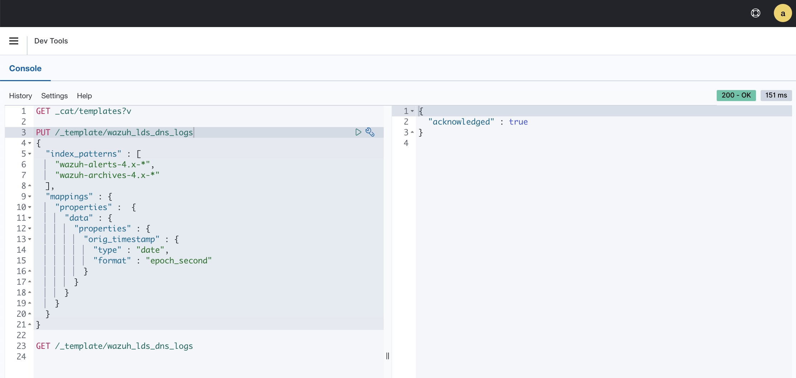

Introduction
============

This document details how to configure log delivery to Wazuh.

This document covers the following
- Wazuh basics / key terminology
- How to configure Wazuh to receive log events
- How to add a Wazuh decoder and alert rule for our log events
- How to configure the LDS Connector to deliver to Wazuh
- Wazuh troubleshooting

Background
===========

Wazuh is an open-source security platform used for threat prevention, detection, and response. The Wazuh [GitHub](https://github.com/wazuh/wazuh) contains a lovely introduction.

The Wazuh architecture is summarized by the following diagram


The Wazuh Server receives logs from remote sources, processes them, and send them to the Wazuh Indexer
- It can receive logs from Wazuh Agents and SysLog clients
- It contains an analysis engine that processes log events
    - The pre-decoding phase parses SysLog-like fields (timestamp, hostname, program name) from the log message. The
      log event is augmented with these fields.
    - The decoding phase finds a decoder matching the log event and uses it to parse fields. The log event is 
      augmented with the fields
    - The rule-matching phase matches a log event against alert rules. If a match is found, an alert is generated. The
      log event is augmented with the rule metadata
- It sends alerts to the Wazuh Indexer
    - All events are saved to `/var/ossec/logs/archives/archives.json`
    - All alerts are saved to `/var/ossec/logs/alerts/alerts.json`. Filebeat monitors this and forwards alerts to the 
      Wazuh Indexer

The Wazuh Indexer is a deployment of OpenSearch. It receives alerts from the Wazuh Server, processes them, and stores 
them in an index. An index is created for each day. 

The Wazuh Dashboard is a web interface into Wazuh. It allows users to search for alerts, create dashboards, and manage
some configuration.


Wazuh Configuration
===================


Enable SysLog Receiving
-----------------------

The LDS connector sends Akamai LDS logs to a Wazuh Server using remote SysLog messages. 

SSH into the Wazuh Server. Add the syslog remote to the Wazuh Server configuration at `/var/ossec/etc/ossec.conf`
- `port`: Any available port
- `protocol`: "tcp" or "udp". I recommend TCP to guarantee delivery. The LDS connector supports both.
- `allowed-ips`: The IP address of the LDS connector host. This can also be a CIDR.
```
<ossec_config>
  <remote>
    <connection>syslog</connection>
    <port>514</port>
    <protocol>tcp</protocol>
    <allowed-ips>127.0.0.1</allowed-ips>
    <allowed-ips>192.168.0.1</allowed-ips>
  </remote>
</ossec_config>
```

Restart the Wazuh Server: `sudo systemctl restart wazuh-manager` 


Create a Decoder
----------------

The Wazuh Server uses a decoder to parse the fields from a log message.

We need to create a custom decoder for our LDS messages. This needs to be done for each LDS log format you're 
delivering to Wazuh. I'll show this for the DNS format.

SSH into the Wazuh Server. Add the decoder definition to `/var/ossec/etc/decoders/`. 

The DNS decoder definition is at [lds_dns_log_decoder.xml](./lds_dns_log_decoder.xml). The `lds_dns_log_decoder` 
decoder applies to any log message with program name (extracted during pre-decoding phase) equal to 
`lds_dns_log`. The `lds_dns_log_fields` decoder is a sub-decoder of `lds_dns_log_decoder` and contains the field 
extractions.

Restart the Wazuh Server: `sudo systemctl restart wazuh-manager` 

Create a Rule
-------------

The Wazuh Server will only send alerts to the Wazuh Indexer.

We need to create an alert rule so that an alert is generated for each LDS log event. This needs to be done for each 
LDS log format you're delivering to Wazuh. I'll show this for the DNS format.

SSH into the Wazuh Server. Add the rule definition to `/var/ossec/etc/rules/`.

The DNS rule definition is at [lds_dns_log_rule.xml](./lds_dns_log_rule.xml). An alert will be generated for any event
that was decoded using the `lds_dns_log_decoder`. You may need to change the rule ID if another rule uses that ID.

Restart the Wazuh Server: `sudo systemctl restart wazuh-manager` 

Create an Index Template
-------------------------

The Wazuh Server augments the log event with fields extracted by the decoder. These fields are all strings. The
Wazuh Server sends the alert log events to the Wazuh Indexer as JSON.

The Wazuh Indexer receives the log events and stores them in an index. A **mapping** defines how a field in
the log event JSON should be stored (i.e. the data type). A **dynamic mapping** is dynamically applied to a field 
based on some assumptions about that field. An **explicit mapping** can be added to override the dynamic mapping.

For example, consider a field called "timestamp" with value "1677705537136". The dynamic mapping would recognize this as 
a timestamp by the field name. It would assume it's an epoch timestamp in milliseconds. It would correctly parse this
into a `date` type with human value Wednesday, March 1, 2023 9:18:57.136 PM.

For another example, consider a field called "timestamp" with value "1677705930". The dynamic mapping would also 
recognize this as a timestamp by the field name. However, it would assume it's an epoch timestamp in milliseconds! 
It would incorrectly parse this into a `date` type with human value Tuesday, January 20, 1970 10:01:45 AM.

How do we fix this? We need to add an **index template** to the Wazuh Indexer. This template will apply to all 
Wazuh alert indices (since one is created for each day). 

This particular issues occurs with the DNS decoder `lds_dns_logs_decoder` on the `orig_timestamp` field. I'll show 
the fix.

We'll run a command in the Wazuh Dashboard. Go to Management > Dev Tools > Console.

Create a template called `wazuh_lds_dns_logs` with the following request. This applies to the daily Wazuh indices, i.e. 
wazuh-alerts-4.x-2023.03.01

```
PUT /_template/wazuh_lds_dns
{
  "index_patterns" : [
    "wazuh-alerts-4.x-*",
    "wazuh-archives-4.x-*"
  ],
  "mappings" : {
    "properties" :  {
      "data" : {
        "properties" : {
          "orig_timestamp" : {
            "type" : "date",
            "format" : "epoch_second"
          }
        }
      }
    }
  }
}
```




LDS Connector Configuration
============================

We need to configure the LDS connector script to deliver logs to Wazuh using SysLog.

You'll need the following information
- The hostname or IP address of the Wazuh Server
- The SysLog port configured above
- The SysLog protocol (TCP or UDP) configured above
- The SysLog program name used above. I used "lds_dns_log".

In your LDS connector YAML configuration file
- Remove the Splunk configuration 
- Add the SysLog configuration 
- Use the [config_template.yaml](../../config_template.yaml) file for reference


Troubleshooting
===============

Validate Wazuh Receives SysLog Messages
---------------------------------------

The Wazuh Server will only send alerts to the Wazuh Indexer. It writes all alerts to 
`/var/ossec/logs/alerts/alerts.json`. This file is monitored and the alerts are sent to the Wazuh Indexer. 
However, Wazuh can also log *all* events to `/var/ossec/logs/archives/archives.json`.

We can monitor this file to check if the Wazuh Server received an LDS log message it couldn't decode or that didn't 
match an alert rule.

Enable all event logging by adding the following to the Wazuh Server configuration at `/var/ossec/etc/ossec.conf`

```
<ossec_config>
  <global>
    <logall_json>yes</logall_json> 
  </global>
</ossec_config>
```

Restart the Wazuh Server: `sudo systemctl restart wazuh-manager`

You can monitor the archives file using `tail` as follows. 
``` sh
$ sudo tail -f /var/ossec/logs/archives/archives.json | grep lds_
{"timestamp":"2023-03-02T09:06:20.955-0800","agent":{"id":"000","name":"sea-lvtu9"},"manager":{"name":"sea-lvtu9"},"id":"1677776780.75386","full_log":"Mar 02 09:06:20 sea-mpgbs lds_another: 416458 - 1672715199 03/01/2023 03:06:39,52.37.159.152,64062,2ww-nigiro.edgedns.zone,IN,A,E,4096,D,,3:NXDOMAIN","predecoder":{"program_name":"lds_another","timestamp":"Mar 02 09:06:20","hostname":"sea-mpgbs"},"decoder":{},"location":"172.27.97.213"}
```
We can see the following log event was successfully pre-decoded, but no decoder was found. The program name didn't 
match our `lds_dns_decoder` program name.

Validate Wazuh SysLog API Allow List
------------------------------------

Wazuh implements an IP allow-list for remote SysLog messages. This was configured above.

The `wazuh-remoted` daemon is responsible for handling syslog messages. You can check the logs using the following 
command.
``` sh 
$ sudo cat  /var/ossec/logs/ossec.log | grep wazuh-remoted | tail -10
2023/03/02 09:24:20 wazuh-remoted: INFO: Started (pid: 4153). Listening on port 513/TCP (syslog).
2023/03/02 09:24:20 wazuh-remoted: INFO: (1410): Reading authentication keys file.
2023/03/02 09:26:15 wazuh-remoted: INFO: (1225): SIGNAL [(15)-(Terminated)] Received. Exit Cleaning...
2023/03/02 09:26:15 wazuh-remoted: INFO: (1225): SIGNAL [(15)-(Terminated)] Received. Exit Cleaning...
2023/03/02 09:26:23 wazuh-remoted: INFO: Started (pid: 7064). Listening on port 1514/TCP (secure).
2023/03/02 09:26:23 wazuh-remoted: INFO: Remote syslog allowed from: '127.0.0.1/8'
2023/03/02 09:26:23 wazuh-remoted: INFO: Remote syslog allowed from: '192.168.0.1'
2023/03/02 09:26:23 wazuh-remoted: INFO: Started (pid: 7065). Listening on port 513/TCP (syslog).
2023/03/02 09:26:23 wazuh-remoted: INFO: (1410): Reading authentication keys file.
2023/03/02 09:27:07 wazuh-remoted: WARNING: (1213): Message from '192.168.0.2' not allowed. Cannot find the ID of the agent.
```

We can see a SysLog message was received from 192.168.0.2. This isn't in the allow list, so the message was ignored.
This IP needs to be added to the allow-list.


Validate Wazuh Decodes SysLog Messages
--------------------------------------

You can test your custom decoder using the `/var/ossec/bin/wazuh-logtest` script. It tells you how a given log message
was pre-decoded, which decoders matched if any, and which rules matched if any. You must restart the Wazuh Server 
after decoder changes. 


```
$ sudo /var/ossec/bin/wazuh-logtest
Starting wazuh-logtest v4.3.10
Type one log per line

Jan 03 03:06:39 127.0.0.1 lds_dns_log: 416458 - 1672715199 03/01/2023 03:06:39,52.37.159.152,64062,2ww-nigiro.edgedns.zone,IN,A,E,4096,D,,3:NXDOMAIN

**Phase 1: Completed pre-decoding.
	full event: 'Jan 03 03:06:39 127.0.0.1 lds_dns_log: 416458 - 1672715199 03/01/2023 03:06:39,52.37.159.152,64062,2ww-nigiro.edgedns.zone,IN,A,E,4096,D,,3:NXDOMAIN'
	timestamp: 'Jan 03 03:06:39'
	hostname: '127.0.0.1'
	program_name: 'lds_dns_log'

**Phase 2: Completed decoding.
	name: 'lds_dns_decoder'
	answer: '3:NXDOMAIN'
	cp_code: '416458'
	dns_class: 'IN'
	dnssec_flag: 'D'
	domain_name: '2ww-nigiro.edgedns.zone'
	edns0_flag: 'E'
	edns0_size: '4096'
	orig_timestamp: '1672715199'
	rr_type: 'A'
	src_ip: '52.37.159.152'
	src_port: '64062'

**Phase 3: Completed filtering (rules).
	id: '100001'
	level: '5'
	description: 'Akamai Edge DNS NXDOMAIN'
	groups: '['akamai', 'edge_dns']'
	firedtimes: '1'
	mail: 'False'
**Alert to be generated.
```


Validate the Firewall
---------------------

Check your firewall. Make sure the SysLog port you chose is enabled.


References
==========

https://wazuh.com/

https://github.com/wazuh/wazuh

https://documentation.wazuh.com/current/getting-started/architecture.html

https://documentation.wazuh.com/current/user-manual/capabilities/log-data-collection/how-it-works.html#remote-syslog

https://documentation.wazuh.com/current/user-manual/ruleset/ruleset-xml-syntax/decoders.html#how-it-works

https://opensearch.org/docs/2.4/opensearch/mappings/

https://opensearch.org/docs/latest/opensearch/index-templates/

https://opensearch.org/docs/2.4/opensearch/supported-field-types/date/
