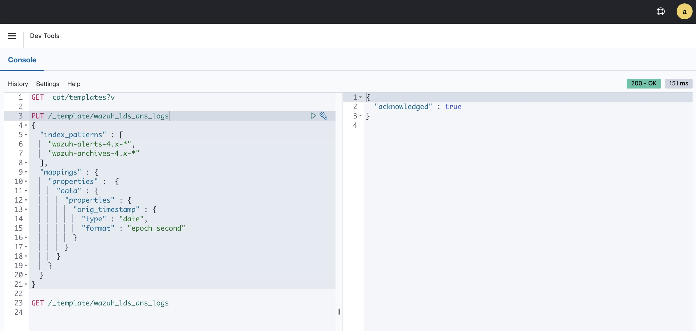

Background
==========

The Wazuh Indexer is just an OpenSearch distribution. It receives alerts from the Wazuh Server. The alerts contain the
decoded fields as text. The Wazuh Indexer will map these fields into typed fields.

A `dynamic mapping` is applied automatically based on the field name and value. 

For example, an epoch timestamp (in milliseconds) field with value "1677705537136" would be dynamically mapped to an 
OpenSearch date type representing 1677705537136 milliseconds from the epoch. Or Wednesday, March 1, 2023 9:18:57.136 PM

An explicit mapping is explicitly defined for a specific field in a specific index. This is useful if the dynamic 
mapping produces undesirable results

For example, an epoch timestamp (in seconds) field with value "1677705930" would be dynamically mapped to an OpenSearch
date type representing 1677705930 **milliseconds** from the epoch. Or Tuesday, January 20, 1970 10:01:45 AM. This is 
wrong. We need to define an explicit mapping to force the Wazuh Indexer to parse the timestamp in seconds.

This happens with Edge DNS logs for the field `orig_timestamp`, which represents when the Edge DNS log was originally
omitted. We need to add an explicit mapping. We need to add this to an index template that applies to all Wazuh indexes,
since it creates a new one each day

Note, multiple index templates can apply to a single index. Wazuh has it's own index template called "wazuh".

Steps
=====

We'll run a request in the Wazuh Dashboard. Go to Management > Dev Tools.

Create a template called `wazuh_lds_dns_logs` with the following request. 

```
PUT /_template/wazuh_lds_dns
{
  "index_patterns" : [
    "wazuh-alerts-4.x-*",
    "wazuh-archives-4.x-*"
  ],
  "mappings" : {
    "properties" :  {
      "data" : {
        "properties" : {
          "orig_timestamp" : {
            "type" : "date",
            "format" : "epoch_second"
          }
        }
      }
    }
  }
}
```



References
==========

https://opensearch.org/docs/2.4/opensearch/mappings/

https://opensearch.org/docs/latest/opensearch/index-templates/

https://opensearch.org/docs/2.4/opensearch/supported-field-types/date/
